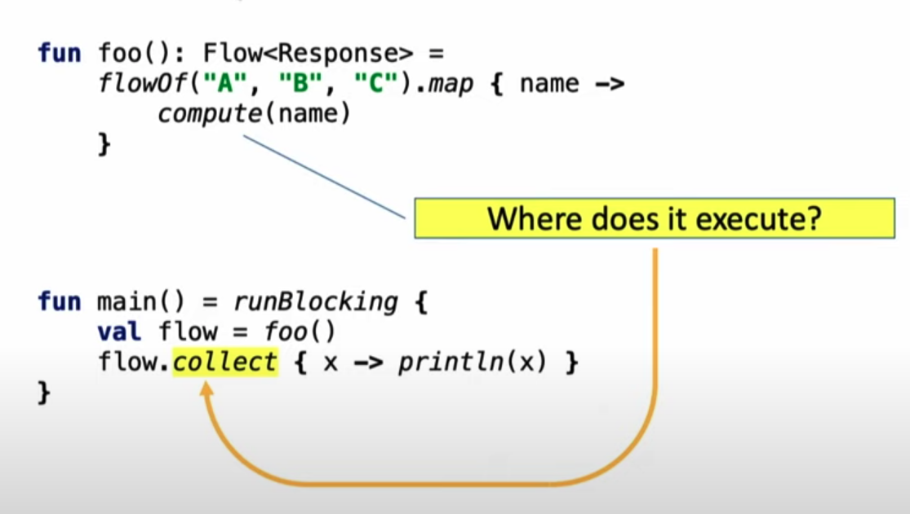
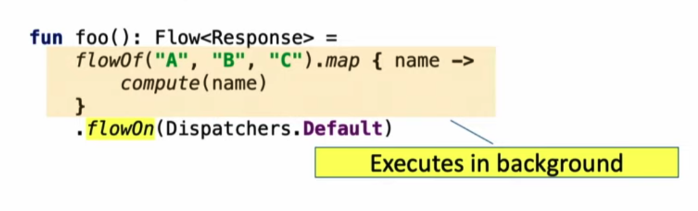
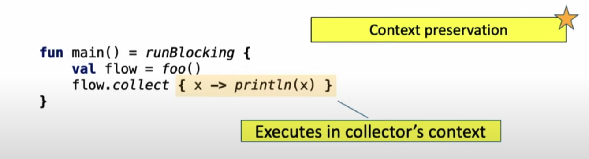
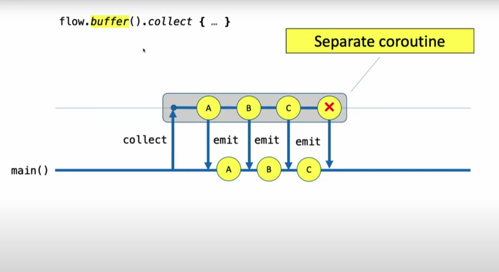

# Primer
## Simple Flow

* `flow()` creates it.
* `emit()` produces new data.
* `collect()` receive the data.

```kotlin
fun numsFlow(): Flow<Int> = flow {
  for (num in listOf(1,2,3)) {
    delay(500)
    emit(num)
  }
}

launch {
  numsFlow().collect { log(it) }
}
```

## Cold Streams
* Flows can be saved in variables.
* Flows are not  emited until it is collected. 
* Flows can be collected multiple times.
  
```kotlin
val nums = numsFlow() // Nothing happends here
nums.collect { log(it) } // Now they are emited
delay(3 * DELAY)
nums.collect { log(it) } //They are emited a second time
```

## Builders
* `flowOf()` 
* `asFlow()`

```kotlin
  val nums = flowOf(1,2,3)
  nums.collect { log(it) }

  val nums2 = listOf(1,2,3).asFlow()
  nums2.collect { log(it) }
```

## Structure Concurrency
* Using concurrency scopes
* Use `withTimeoutOrNull()` for timers
```kotlin
  fun itemsFlow() = flow {
    for (item in listOf(1, 2, 3, 4, 5)) {
      delay(500)
      log("emit: $item")
      emit(item)
    }
  }
  withTimeoutOrNull((3.1 * 500.0).toLong()) {
    itemsFlow().collect { log("collect: $it") }
  }
// 1
// 2
// 3
```

## Operators
### Transformation
* `map()` and `filter()`  as in Rx
```kotlin
val itemsFlow = flowOf(1, 2, 3, 4, 5)
itemsFlow
  .filter { it > 3 }
  .map { "Number $it" }
  .collect { log("item >5 && to Number: $it") }
  // > item >5 && to Number: Number 4
  // > item >5 && to Number: Number 5
```

* `transform()`:  
  
Like map and filter, with more complex transformations. Can emit arbitrary values an arbitrary number of times.
```kotlin
(1..3).asFlow() // a flow of requests
    .transform { request ->
        emit("Making request $request") 
        emit(performRequest(request)) 
    }
    .collect { response -> println(response) }

// Making request 1
// response 1
// Making request 2
// response 2
// Making request 3
// response 3

```

### Size Limiting operators
`take()`
```kotlin
fun numbers(): Flow<Int> = flow {
    try {                          
        emit(1)
        emit(2) 
        println("This line will not execute")
        emit(3)    
    } finally {
        println("Finally in numbers")
    }
}

fun main() = runBlocking<Unit> {
    numbers() 
        .take(2) // take only the first two
        .collect { value -> println(value) }
}  
// 1
// 2
// Finally in numbers
```
### Terminal flow operators
> Terminal operators on flows are suspending functions that start a collection of the flow.
* `collect()`: the most basic one.
* `toList()` and `toSet()`:  Conversion to various collections.
* `first()`: Get the first value. 
* `single()`: ensure that a flow emits only one value.
* `reduce()` and `fold()`: For reducing a flow to a value.
 
 ## Completion
 
* The only way to consume values or iterate over a flow is to use a terminal operator.
* Because all terminal operators are suspend functions, the work is bound to the lifetime of the scope that calls them. 
* When the scope is cancelled, the flow will automatically cancel itself using the regular coroutine cooperative cancellation rules. 

 ### Imperative: finally block
 ```kotlin
fun foo(): Flow<Int> = (1..3).asFlow()
fun main() = runBlocking<Unit> {
    try {
        foo().collect { value -> println(value) }
    } finally {
        println("Done")
    }
}            
// 1
// 2
// 3
// Done
 ```

 ### Declarative handling
 ```kotlin
 foo()
    .onCompletion { println("Done") }
    .collect { value -> println(value) }
// 1
// 2
// 3
// Done
```

# Working with Flows

## Upstream vs Downstream   
```java
//   Upstream     Downstream   
emiter ----> process ----> collect
``` 

## Where does it run?

## Change context
* `flowOn` : Changes the context where this flow is executed to the given context.
* `context` does not leak into the downstream flow.
* Upstream never affect the context of the downstream.

 
 


 ```kotlin
 withContext(Dispatchers.Main) {
    val singleValue = intFlow // will be executed on IO if context wasn't specified before
        .map { ... } // Will be executed in IO
        .flowOn(Dispatchers.IO)
        .filter { ... } // Will be executed in Default
        .flowOn(Dispatchers.Default)
        .single() // Will be executed in the Main
}
```

## Concurrency operators
* Because emit always wait to collect to end, Flow has automatic **Backpressure**. 
* Concurrency operators allow us to define how we handle the **Backpressure** and achieve **Concurrency**

### `buffer()`
Allows to `emit` code concurrently while `collecting` instead of waiting to `collect` next item is called.



```kotlin
fun foo(): Flow<Int> = flow {
    for (i in 1..3) {
        delay(100)
        emit(i) // emit next value when collect is called.
    }
}

fun main() = runBlocking<Unit> { 
        foo()
        .collect { // Is called after iteration is finished
            delay(300) 
            println(it) 
        } 
    }   
}
```
Because when `collect` is called `emit` emits the next value. `emit` waits 300ms to produce next value.

The whole operation takes `1200ms` = `3*100 + 3*300`

Using buffer
```kotlin
val time = measureTimeMillis {
    foo()
        .buffer() // buffer emissions, don't wait
        .collect { 
            delay(300)
            println(it) 
        } 
}   
```
Because we are using `buffer` here, emissions don't wait for next `collect` to be called.

The whole operation takes `1000ms` = `1*100 + 3*300`

### `conflate()`
Skips intermediate values when a collector is too slow to process them

```kotlin
val time = measureTimeMillis {
    foo()
        .conflate() // skip items that can't be processed. "If has to wait skip it"
        .collect { 
            delay(300)
            println(it) 
        } 
}   
// 1
// 3
```

### `collectLatest()`
Cancels a slow collector and restart it every time a new value is emitted. 

```kotlin
  foo()
    .collectLatest { value -> // cancel & restart on the latest value
        println("Collecting $value") 
        delay(300) 
        println("Done $value") 
    } 
}  
// Collecting 1
// Collecting 2
// Collecting 3
// Done 3
```

## Composing flows
### `zip()`
Combines the corresponding values of two flows.

```kotlin
val nums = (1..3).asFlow() // numbers 1..3
val strs = flowOf("A", "B", "C") // strings 
nums.zip(strs) { a, b -> "$a -> $b" } // compose a single string
    .collect { println(it) } // collect and print
// 1 -> A
// 2 -> B
// 3 -> C
```

One flow must wait the other until it gets it corresponding value.
```
nums: 1  -----  2  -----  3  
strs: ----  A  ---------- B  --------  C
out:  ---- 1A  ---------- 2B  --------  3C
```

### `combine()`
Performs a computation that depends on the most recent values of the corresponding flows and to recompute it whenever any of the upstream flows emit a value.
```kotlin
val nums = (1..3).asFlow().onEach { delay(300) } // numbers 1..3 every 300 ms
val strs = flowOf("A", "B", "C").onEach { delay(400) } // strings every 400 ms          
val startTime = System.currentTimeMillis() // remember the start time 
nums.combine(strs) { a, b -> "$a -> $b" } // compose a single string with "combine"
    .collect { value -> // collect and print 
        println("$value at ${System.currentTimeMillis() - startTime} ms from start") 
    } 
// 1 -> A at 452 ms from start
// 2 -> A at 651 ms from start
// 2 -> B at 854 ms from start
// 3 -> B at 952 ms from start
// 3 -> C at 1256 ms from start    
```
```
nums: 1  -----  2  -------- 3  
strs: --- A  --------- B ---------- C
out:  --- 1A -- 2A --- 2B -- 3B --- 3C
```

## `flatMap` Familly
### `flatMapConcat()`
Waits for the inner flow to complete before starting to collect the next one.

Similiar to composing operator `zip()`.

```kotlin
fun requestFlow(i: Int): Flow<String> = flow {
    emit("$i: First") 
    delay(500) // wait 500 ms
    emit("$i: Second")    
}
(1..3).asFlow().onEach { delay(100) } // a number every 100 ms 
    .flatMapConcat { requestFlow(it) }                                                                           
    .collect { value -> // collect and print 
        println("$value at ${System.currentTimeMillis() - startTime} ms from start") 
    } 
// 1: First at 140 ms from start
// 1: Second at 641 ms from start
// 2: First at 741 ms from start
// 2: Second at 1242 ms from start
// 3: First at 1342 ms from start
// 3: Second at 1842 ms from start

```
### `flatMapMerge()`
Concurrently collects all the incoming flows and merge their values into a single flow so that values are emitted as soon as possible.

Similiar to composing operator `combine()`.

Accepts an optional concurrency parameter that limits the number of concurrent flows that are collected at the same time. If `1` will perform as a `flatMapConcat` 

```kotlin
val startTime = System.currentTimeMillis()
(1..3).asFlow().onEach { delay(100) } // a number every 100 ms 
    .flatMapMerge { requestFlow(it) }                                                                           
    .collect { value -> // collect and print 
        println("$value at ${System.currentTimeMillis() - startTime} ms from start") 
    } 
// 1: First at 136 ms from start
// 2: First at 231 ms from start
// 3: First at 333 ms from start
// 1: Second at 639 ms from start
// 2: Second at 732 ms from start
// 3: Second at 833 ms from start
```    

### `flatMapLatests()`
A collection of the previous flow is cancelled as soon as new flow is emitted.

Similiar to buffering operator `collectLatest()`.
```kotlin
(1..3).asFlow().onEach { delay(100) } 
    .flatMapLatest { requestFlow(it) }                                                                           
    .collect { println("$it") } 
// 1: First
// 2: First
// 3: First
// 3: Second
```

## Excepetions

### Collector try and catch
Wrap the collector with `try/catch` if it fails no more values are collected.
```kotlin
fun foo(): Flow<Int> = flow {
    for (i in 1..3) {
        println("Emitting $i")
        emit(i) // emit next value
    }
}

fun main() = runBlocking<Unit> {
    try {
        foo().collect { value ->         
            println(value)
            check(value <= 1) { "Collected $value" }
        }
    } catch (e: Throwable) {
        println("Caught $e")
    } 
} 
// Emitting 1
// 1
// Emitting 2
// 2
// Caught java.lang.IllegalStateException: Collected 2
```
#### Everything is caught
Here everything is caught, it catches any exception happening in the **emitter** or in any **intermediate** or **terminal** operators
```kotlin
fun foo(): Flow<String> = 
    flow {
        for (i in 1..3) {
            println("Emitting $i")
            emit(i) 
        }
    }
    .map { value ->
        check(value <= 1) { "Crashed on $value" }                 
        "string $value"
    }

fun main() = runBlocking<Unit> {
    try {
        foo().collect { value -> println(value) }
    } catch (e: Throwable) {
        println("Caught $e")
    } 
}
// Same result as before 
```
Exception is still caught and collection is stopped:

### Exception transparency
* Code of the emitter must encapsulate its exception handling behavior.
* Is a violation of the *exception transparency* to emit values in the flow { ... } builder from inside of a `try/catch` block.

#### `catch()`
Preserves *exception transparency* and allows encapsulation of its exception handling.

The body of the catch operator can analyze an exception and react to it in different ways
* Exceptions can be rethrown using throw.
* Exceptions can be turned into emission of values using emit from the body of catch.
* Exceptions can be ignored, logged, or processed by some other code

```kotlin
fun main() = runBlocking<Unit> {
    foo()
        .catch { e -> emit("Caught $e") } // emit on exception
        .collect { value -> println(value) }
// Same result as before 
```
Same results even though there is no try/catch around the code anymore


### Transparent catch
The `catch` intermediate operator, honoring exception transparency, catches only upstream exceptions 
(that is an exception from all the operators above `catch`, but not below it).
If the block in collect { ... } (placed below `catch`) throws an exception then it escapes

```kotlin
fun foo(): Flow<Int> = flow {
    for (i in 1..3) {
        println("Emitting $i")
        emit(i)
    }
}

fun main() = runBlocking<Unit> {
    foo()
        .catch { e -> println("Caught $e") } // does not catch downstream exceptions
        .collect { value ->
            check(value <= 1) { "Collected $value" }                 
            println(value) 
        }
} 
```
A "Caught …" message is not printed despite there being a `catch` operator.


### Catching declaratively. `onEach()`
* We can combine the declarative nature of the `catch` operator with a desire
 to handle all the exceptions.
* Move the body of the collect operator into `onEach` and put it before the `catch` operator. 
* Collection of this flow must be triggered by a call to `collect()` without parameters

```kotlin
foo()
    .onEach { value ->
        check(value <= 1) { "Collected $value" }                 
        println(value) 
    }
    .catch { e -> println("Caught $e") }
    .collect()
```

# ANDROID
## ROOM
```kotlin
@Query("SELECT * FROM table ORDER  BY id")
fun loadAllItems(): Flow<List<Item>>

val allItems: Flow<List<Item>> = dao.loadAllItems()
  .flowOn(defaulDispatcher)
  .conflate()
```

# StateFlow/EventFlow
